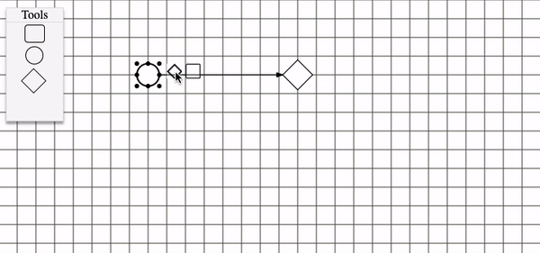

<body>

  <!--
Uses cases 
-->
  
  

  

    

      <h1 class="use-case-title"> Game of life</h1>
      

        The <b>game of life</b> takes place on a theoretically infinite two-dimensional grid, whose cells - called "cells", by analogy with living cells - can assume two distinct states: "alive" or "dead". A cell has eight neighbors, which are the cells adjacent horizontally, vertically and diagonally.
      

      <a href="https://duamelo.github.io/game_of_life/" class="use-case-button">Live preview</a>
    

    

      
    

  

  
  

    

      
    

     

      <h1 class="right-use-case-title">MBP-flowchat</h1>
      

        <b>MBP-flowchat</b> is an aya-based tool that allows you to perform business processes
      

      <a href="#!" class="use-case-button">Live preview</a>
    

    
    
  

  
Released under the MIT License.

  
Copyright © 2022-present David DOSSEH

   

</body>
